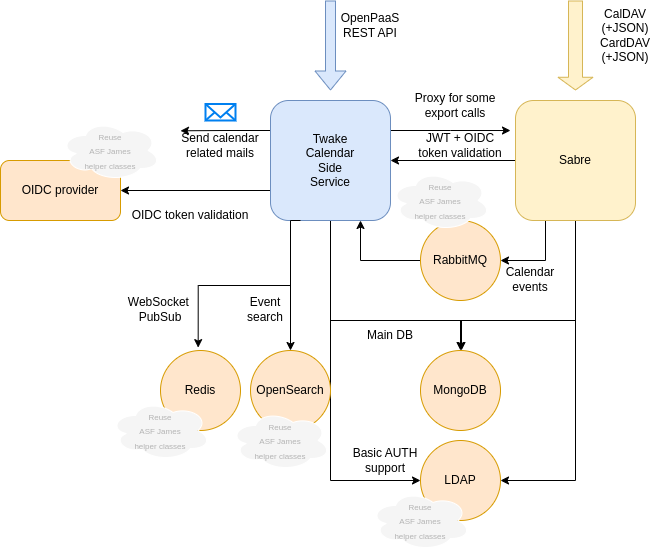

# Twake Calendar Side service


## Goals

This service aims at interacting with a [esn-sabre](https://github.com/linagora/esn-sabre/) backend and OpenPaaS single 
page applications being [calendar](https://github.com/linagora/esn-frontend-calendar) and 
[contacts](https://github.com/linagora/esn-frontend-contacts).

It vows to strictly follow OpenPaaS APIs as integration tested by [dav-integrationTesting](https://ci.linagora.com/btellier/dav-integrationtesting).

It vows to follow OpenPaaS DB structure (at least for now as we might see DB refactoring dropping MongoDB).

However, despite those above statements it shall be seen as a very aggressive refactoring as it technically is a full rewrite.

We aim for a pragmatic approach by reusing most of the tooling that made Twake mail successful.

## Running it

### Compile and run with CLI

Requires maven 3.9.6 + and JDK 21

In order to compile the application, run:

```bash
mvn clean install --am --pl :twake-calendar-side-service-app -DskipTests
```

Then run it with:

```bash
java -cp twake-calendar-side-service/app/target/twake-calendar-side-service-app-1.0.0-SNAPSHOT.jar com.linagora.calendar.app.TwakeCalendarMain
```

### Run with docker

Compilation will build a tar that needs to be imported in your local docker engine:

```bash
docker load -i twake-calendar-side-service/app/target/jib-image.tar
```

Then it can easily be run with:

```bash
docker run --rm -ti linagora/twake-calendar-side-service:latest
```

There is currently no way to run Twake Calendar side service with docker but as soon as it is available we will document it here!

## Configuring it

TODO

We are initializing the project so we can't configure it yet.

When it will be possible we will document this in this section.

## Contributing

At LINAGORA we warmly welcome feedbacks and contributions.

We expect quality contributions matching the scope of the project.

We recommend discussing the contribution (GitHub issues or discussion) prior writing some code.

LINAGORA owns the code base so alone is entitled to decide what shall be accepted or not as a contribution
and became owner of the contribution. However, we will retain paternity of the contribution (git history
and if applicable / requested in comments)

## Roadmap

We aim for replacing [OpenPaaS](https://open-paas.org/) by the end of 2025.

Then we might add websocket push to this project.

Next development items are not specified yet. We could envision replacing [MongoDB backend](https://www.mongodb.com/) by
[PostgreSQL](https://www.postgresql.org/) document DB but this is not decided yet.

## Architecture



In addition to this target architecture, in order to allow easy deployment of our solution, the 
`Twake Calendar Side Service` will also proxy HTTP calls it do not handle (yet) to the soon-to-be-replaced 
`OpenPaaS` server.

Regarding observability, we intend Twake Calendar Side Service to be on par with Twake Mail: structured JSON logs 
collected via [Loki](https://grafana.com/oss/loki/), metrics gathered by [Prometheus](https://prometheus.io/). 

Implemented APIs:
 - WebAdmin heathcheck routes
 - Metrics

## Credits

Developed with <3 at [LINAGORA](https://linagora.com) !